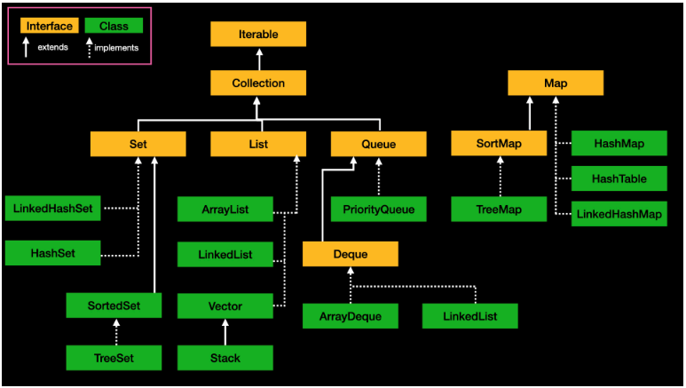

# Java Collection Framework(JCF)

컬렉션 프레임워크는 크게 Collection 인터페이스와 Map 인터페이스로 나뉜다.
List와 Set 인터페이스를 구현한 컬렉션 클래스들은 공통 부분이 많기 때문에, 공통된 부분을 모은 Collection 인터페이스로 상속 되어있다.
Map 인터페이스의 컬렉션들은 두 개의 데이터를 묶어 한 쌍으로 다루기 때문에 Collection 인터페이스와 따로 분리되어 있다.

[Collection Interface](https://github.com/roqdkfwk/Computer-science/blob/main/Data%20Structure/Java%20Collection%20Framework(JCF)/Collection%20Interface.md)

[List Interface](https://github.com/roqdkfwk/Computer-science/blob/main/Data%20Structure/Java%20Collection%20Framework(JCF)/List%20Interface.md)

[Queue Interface](https://github.com/roqdkfwk/Computer-science/blob/main/Data%20Structure/Java%20Collection%20Framework(JCF)/Queue%20Interface.md)

[Deque Interface](https://github.com/roqdkfwk/Computer-science/blob/main/Data%20Structure/Java%20Collection%20Framework(JCF)/Deque%20Interface.md)

[Set Interface](https://github.com/roqdkfwk/Computer-science/blob/main/Data%20Structure/Java%20Collection%20Framework(JCF)/Set%20Interface.md)

[Map Interface](https://github.com/roqdkfwk/Computer-science/blob/main/Data%20Structure/Java%20Collection%20Framework(JCF)/Map%20Interface.md)

[Map.Entry Interface](https://github.com/roqdkfwk/Computer-science/blob/main/Data%20Structure/Java%20Collection%20Framework(JCF)/Map%20Entry%20Interface.md)

[ArrayList Class](https://github.com/roqdkfwk/Computer-science/blob/main/Data%20Structure/Java%20Collection%20Framework(JCF)/ArrayList%20Class.md)

[LinkedList Class](https://github.com/roqdkfwk/Computer-science/blob/main/Data%20Structure/Java%20Collection%20Framework(JCF)/LinkedList%20Class.md)

[Vector Class](https://github.com/roqdkfwk/Computer-science/blob/main/Data%20Structure/Java%20Collection%20Framework(JCF)/Vector%20Class.md)

[Stack Class](https://github.com/roqdkfwk/Computer-science/blob/main/Data%20Structure/Java%20Collection%20Framework(JCF)/Stack%20Class.md)

[PriorityQueue Class](https://github.com/roqdkfwk/Computer-science/blob/main/Data%20Structure/Java%20Collection%20Framework(JCF)/PriorityQueue%20Class.md)

[ArrayDeque Class](https://github.com/roqdkfwk/Computer-science/blob/main/Data%20Structure/Java%20Collection%20Framework(JCF)/ArrayDeque%20Class.md)

[Deque - LinkedList Class](https://github.com/roqdkfwk/Computer-science/blob/main/Data%20Structure/Java%20Collection%20Framework(JCF)/Deque%20-%20LinkedList%20Class.md)

[HashSet Class](https://github.com/roqdkfwk/Computer-science/blob/main/Data%20Structure/Java%20Collection%20Framework(JCF)/HashSet%20Class.md)

[LinkedHashSet Class](https://github.com/roqdkfwk/Computer-science/blob/main/Data%20Structure/Java%20Collection%20Framework(JCF)/LinkedHashSet%20Class.md)

[TreeSet Class](https://github.com/roqdkfwk/Computer-science/blob/main/Data%20Structure/Java%20Collection%20Framework(JCF)/TreeSet%20Class.md)

[EnumSet Abstract Class](https://github.com/roqdkfwk/Computer-science/blob/main/Data%20Structure/Java%20Collection%20Framework(JCF)/EnumSet%20Abstract%20Class.md)

[HashMap Class](https://github.com/roqdkfwk/Computer-science/blob/main/Data%20Structure/Java%20Collection%20Framework(JCF)/HashMap%20Class.md)

[LinkedHashMap Class](https://github.com/roqdkfwk/Computer-science/blob/main/Data%20Structure/Java%20Collection%20Framework(JCF)/LinkedHashMap%20Class.md)

[TreeMap Class](https://github.com/roqdkfwk/Computer-science/blob/main/Data%20Structure/Java%20Collection%20Framework(JCF)/TreeMap%20Class.md)

[HashTable Class](https://github.com/roqdkfwk/Computer-science/blob/main/Data%20Structure/Java%20Collection%20Framework(JCF)/HashTable%20Class.md)
