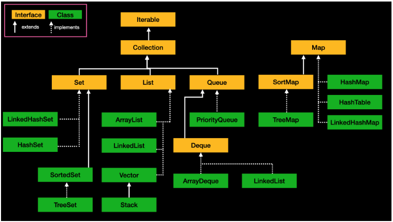

# TreeMap Class

---

- 이진 검색 트리의 형태로 키(key)와 값(value)의 쌍으로 이루어진 데이터를 저장 (TreeSet과 같은 원리)
- TreeMap은 SortedMap 인터페이스를 구현하고 있어 **key값을 기준으로 정렬**되는 특징을 가지고 있다.
- 정렬된 순서로 key : value 쌍을 저장하므로 **빠른 검색(특히 범위 검색)이 가능**하다.
- 단, **키와 값을 저장하는 동시에 정렬을 행하기 때문에 저장 시간이 다소 걸린다.**
- 정렬되는 순서는 숫자 → 알파벳 대문자 → 알파벳 소문자 → 한글 순이다.

---

### TreeMap 메소드

| **메소드** | **설명** | **시간복잡도** |
| --- | --- | --- |
| `V put(K key, V value)` | 지정된 키와 값을 맵에 추가한다. | `O(log n)` |
| `V get(Object key)` | 지정된 키에 대응되는 값을 반환한다. | `O(log n)` |
| `V remove(Object key)` | 지정된 키와 대응되는 값을 같이 제거한다. | `O(log n)` |
| `boolean containsKey(Object key)` | 지정된 키가 맵에 있는지 확인한다. | `O(log n)` |
| `boolean containsValue(Object value)` | 지정된 값이 맵에 있는지 확인한다. | `O(n)` |
| `int size()` | 맵의 키-값 쌍의 수를 반환한다. | `O(1)` |
| `boolean isEmpty()` | 맵이 비어있는지 확인한다. | `O(1)` |
| `void clear()` | 맵의 모든 키-값 쌍을 제거한다. | `O(n)` |
| `K firstKey()` | 가장 낮은 키를 반환한다. | `O(log n)` |
| `K lastKey()` | 가장 높은 키를 반환한다. | `O(log n)` |
| `K lowerKey(K key)` | 주어진 키보다 작은 가장 큰 키를 반환한다. | `O(log n)` |
| `K higherKey(K key)` | 주어지 키보다 큰 가장 작은 키를 반환한다. | `O(log n)` |
| `K floorKey(K key)` | 주어진 키보다 작거나 같은 가장 큰 키를 반환한다. | `O(log n)` |
| `K ceilingKey(K key)` | 주어진 키보다 크거나 같은 가장 작은 키를 반환한다. | `O(log n)` |
| `Map.Entry(K, V) pollFirstEntry()` | 가장 낮은 키의 매핑을 제거하고 반환한다. | `O(log n)` |
| `Map.Entry(K, V) pollLastEntry()` | 가장 높은 키의 매핑을 제거하고 반환한다. | `O(log n)` |
| `NavigableMap<K, V> descendingMap()` | 역순으로 정렬된 맵의 뷰를 반환한다. | `O(1)` |
| `SortedMap<K, V> subMap(K fromKey, K toKey)` | 지정된 범위의 키를 가진 맵의 뷰를 반환한다. | `O(log n)` |
| `SortedMap<K, V> headMap(K toKey)` | 지정된 키보다 작은 키를 가진 맵의 뷰를 반환한다. | `O(log n)` |
| `SortedMap<K, V> tailMap(K fromKey)` | 지정된 키보다 크거나 같은 키를 가진 맵의 뷰를 반환한다. | `O(log n)` |
| `Set<SortedMap<K, V>> entrySet()` | 맵의 매핑에 대한 Set 뷰를 반환한다. | `O(1)` |
| `Set<K> keySet()` | 맵의 키에 대한 Set 뷰를 반환한다. | `O(1)` |
| `Collection<V> values()` | 맵의 값에 대한 컬렉션 뷰를 반환한다. | `O(1)` |