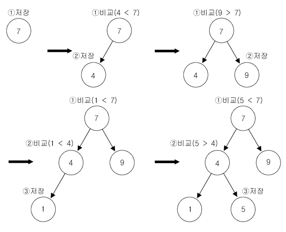

# TreeSet

---

## TreeSet이란?

[**JCF(Java Collection Framework)**](https://www.notion.so/Java-Collection-Framework-JCF-7eb6348de16f4587935115f6419b4ec7?pvs=21)의 일부로, 정렬된 순서로 요소를 저장하는 `Set` 인터페이스의 구현

**이진탐색트리(BinarySearch Tree)**의 구조로 되어있어, 데이터를 넣을 때 자동으로 정렬된다.

일반적인 `Set`보다 데이터 추가, 삭제에는 시간이 오래 걸리지만 정렬되어 저장된다는 점 때문에 조회가 빠르다.

**기본 정렬은 오름차순 정렬**이며, 생성자의 매개변수로 `Comparator` 클래스를 구현하면 정렬 방법을 설정할 수 있다.

---

## TreeSet의 특징

### 정렬된 순서 유지

- `TreeSet`은 요소를 자동으로 오름차순으로 정렬한다. 이를 위해 내부적으로 이진탐색트리, 그 중에서도 [\*\*레드-블랙 트리](https://www.notion.so/Red-Black-Tree-665050462e18470fa913a4d2fbceb13b?pvs=21)로 구현\*\*되어 있다.
- `Comparator`를 사용하여 사용자가 정렬 순서를 정의할 수 있다.

---

### 중복 불허

- `Set` 인터페이스를 구현하므로, 중복된 요소를 허용하지 않는다.
- 이미 존재하는 요소를 추가하려고 하면, 추가 동작이 무시된다.

---

### 빠른 검색, 추가, 제거

- 요소 추가, 제거, 검색 등의 기본 연산의 시간 복잡도는 `O(log n)`이다.

---

## 주요 메소드

| 메서드                                   | 설명                                           | 시간복잡도 |
| ---------------------------------------- | ---------------------------------------------- | ---------- |
| boolean add(E e)                         | 주어진 객체를 저장 후 성공하면 true,           |
| 중복 객체면 false를 반환                 | O(log n)                                       |
| boolean remove(Object o)                 | 특정 요소(o)를 제거한다. 제거에 성공하면 true, |
| 특정 요소가 존재하지 않으면 false를 반환 | O(log n)                                       |
| boolean contains(Object o)               | 특정 요소(o)가 포함되어 있는지 확인한다.       |

특정 요소가 Set에 존재하면 true,
존재하지 않으면 false를 반환 | O(log n) |
| E first() | Set에서 가장 작은 요소를 반환
Set이 비어 있으면
NoSuchElementException이 발생 | O(log n) |
| E last() | Set에서 가장 큰 요소를 반환
Set이 비어 있으면
NoSuchElementException이 발생 | O(log n) |
| E pollFirst() | Set에서 가장 작은 요소를 제거하고 반환
Set이 비어 있으면 null을 반환 | O(log n) |
| E pollLast() | Set에서 가장 큰 요소를 제거하고 반환
Set이 비어 있으면 null을 반환 | O(log n) |
| NavigableSet<E> subSet
(E fromElement, E toElement) | 지정된 범위의 요소들을
NavigableSet<E>형태로 반환 | O(log n) + 범위 내 요소 개수 |
| E headSet(E toElement) | 지정된 요소보다 작은 모든 요소들을 NavigableSet<E>형태로 반환 | O(log n) + 범위 내 요소 개수 |
| E tailSet(E fromElement) | 지정된 요소보다 크거나 같은 모든 요소들을 NavigableSet<E>형태로 반환 | O(log n) + 범위 내 요소 개수 |
| int size() | Set에 포함된 요소의 개수를 반환 | O(1) |
| void clear() | Set에 포함된 모든 요소를 제거 | O(n) |

---

### TreeSet 사용법

- **TreeSet 선언**

  ```java
  TreeSet<Integer> set = new TreeSet<>();  // TreeSet 생성
  set.add(7);
  set.add(4);
  set.add(9);
  set.add(1);
  set.add(5);
  ```

  > TreeSet에 값이 추가되는 과정

  

  이진 검색 트리에 7, 4, 9, 1, 5의 순서로 값을 저장하는 경우

- **TreeSet 값 삭제**
  ```java
  TreeSet<Integer> set = new TreeSet<>();
  set.remove(1);  // set에서 1을 제거
  set.clear();  // set에서 모든 값을 제거
  ```
- **TreeSet 크기 구하기**

  ```java
  TreeSet<Integer> set = new TreeSet<>(Arrays.asList(1, 2, 3));  // 초기값 지정
  set.size();  // 3
  ```

- **TreeSet 값 출력**
  ```java
  TreeSet<Integer> set = new TreeSet<>(Arrays.asList(4, 2, 3));  // 초기값 지정

  System.out.println(set);  // [2, 3, 4]
  System.out.println(set.first());  // 4
  System.out.println(set.last());  // 2

  Iterator iter = set.iterator();  // Iterator 사용
  while (iter.hasNext()) {
  		System.out.println(iter.next());
  }
  ```
    <aside>
    💡 `Iterator`란?
    [Iterator](https://www.notion.so/Iterator-cdeddd9dc35d4f6e841082d8d63f044e?pvs=21)
    
    </aside>
